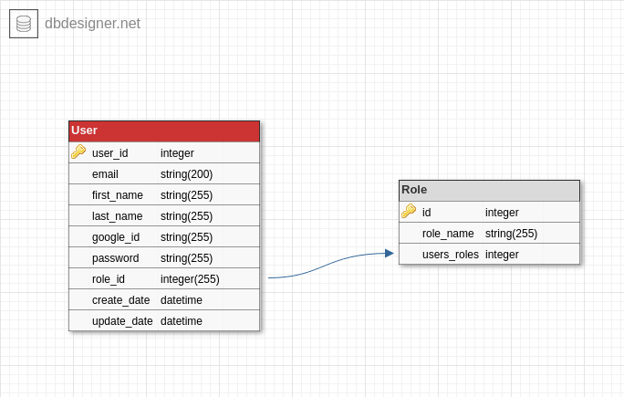

# Users service [](https://travis-ci.org/lv-412-python/users-service-repo)
## Description
This is the source code of the users service, part of 4m project. This service stores data about users and allows to register and sign in on the Web page

## Technologies
* Python (3.6.8)
* Flask (1.0.3)
* PostgreSQL (10.8)
* Docker (18.09.7)

## ER diagram


## Install
For the next steps of service installation, you will need setup of Docker

### In the project root dockerize service:

```
docker run --name some-postgres -e POSTGRES_PASSWORD=mysecretpassword -d postgres
sudo start.sh
flask db upgrade
```


## Project team:
* **Lv-412.WebUI/Python team**:
    - @sikyrynskiy
    - @olya_petryshyn
    - @taraskonchak
    - @OlyaKh00
    - @ement06
    - @iPavliv
    - @Anastasia_Siromska
    - @romichh
